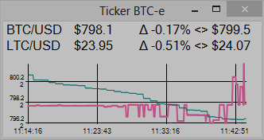

True Terminal
===========
Ticker/Terminal for BTC-e. (changing pairs in config)
Windows only. Need .NET 4.5.

Features:
- Best simplest solution for monitoring/trading Bitcoin and other crypto coins!
- Window stay on top with transparent, on focus opacity changing
- Candlestick chart (candle = 1 min, last 60 minutes)
- Order book (price, volume, depth)
- Open orders
- Settings (config.ini file)

ToDo:
- Volume
- Indicators: MA, MACD, Stoch, ROC
- Trading interface (Sell/Buy)
- Tracking orders
- Trading statistic

Work in progress!
