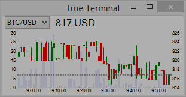
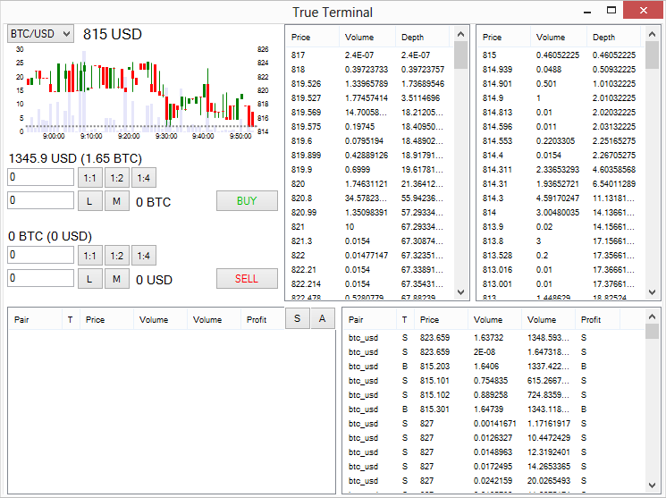

True Terminal
===========
Ticker/Terminal for BTC-e (Bitcoin market).

If you want trading: rename config.ini_example to config.ini and add you APIKey/Secret.

Features
-----------
- Best simplest solution for monitoring/trading Bitcoin and other crypto coins!
- **Candlestick chart** (candle = 1 min, last 60 minutes)
- Volumes
- Trading interface
- **Profit steps**
- Order book (price, volume, depth)
- **Stop loss** (work only with running program and on active pair)
- Open orders, cancellation, **editing**
- Group orders in history with similar price
- **Balance history**
- Changing pairs
- Window stay on top with transparent, on focus opacity changing
- Settings (config.ini file)
- Checkboxes for resize, opacity, top

On top (ticker):

And on focus:

Understanding Stop loss and Take profit
-----------
**This features work on client side and have inner balance. Will be work only if program running and network ok. After restart client this type of orders will be removed.**

Examples:
- You want sell if price <= 100 - create **Stop loss** order and regular order will be created if price <= 100.
- You want sell if price >= 1000 - create **Take profit** order and regular order will be created if price >= 1000.

ToDo
-----------
- Take profit
- Refactoring
- Big resizable chart
- Indicators: Depth, MA, MACD, Stoch, ROC

Work in progress!
-----------
